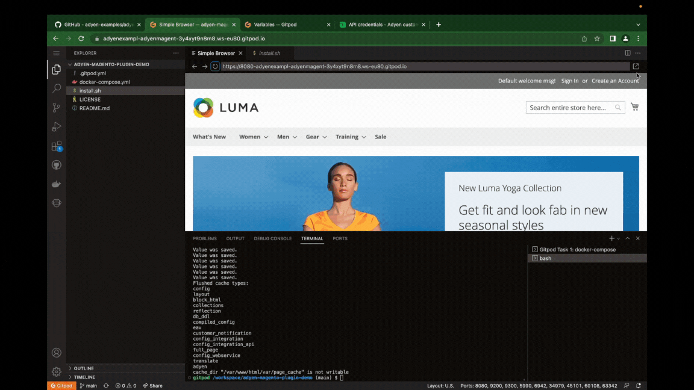

# Adyen [Magento 2 Plugin](https://docs.adyen.com/plugins/magento-2) integration demo

In this demo, you can spin up a Magento instance and install the [Adyen Payment plugin](https://marketplace.magento.com/adyen-module-payment.html) to see how it works. You can try this demo online in one click using Gitpod (a remote IDE) or locally on your computer using Docker.

## Demo [Video](https://youtu.be/taqI7cp7OmM)
[](https://youtu.be/taqI7cp7OmM)


## Running online with [Gitpod](https://gitpod.io/)

1. Open your [Adyen Test Account](https://ca-test.adyen.com/ca/ca/overview/default.shtml) and create a set of [API keys](https://docs.adyen.com/user-management/how-to-get-the-api-key).
2. 
 - Go to [gitpod account variables](https://gitpod.io/variables)
 - Set the `ADYEN_API_KEY`, `ADYEN_CLIENT_KEY` and `ADYEN_MERCHANT_ACCOUNT` variables (Scope: `adyen-examples/*`).
 - Set `ADMIN_USERNAME` and `ADMIN_PASSWORD` in the Gitpod account variables as well. These will be used as your login credentials in the Magento admin dashboard. (Scope: `adyen-examples/*`).
 > __Note__ `ADMIN_PASSWORD` must contain alphanumeric characters (Magento requirement).   
 
3. Click the button below and **wait ~260s (4 minutes)** (for the Magento installation). You should have `magento2-container  | Starting periodic command scheduler: cron.` before proceeding to next step.

[](https://gitpod.io/#https://github.com/adyen-examples/adyen-magento-plugin-demo)

4. Open a new Terminal in the current directory and run `./install.sh` to install and configure the Adyen payment plugin.
5. Visit your shop on the generated preview URL
6. Visit `previewURL/admin/` and login to see that the Magento Plugin is installed correctly.
Login using the `ADMIN_USERNAME` and `ADMIN_PASSWORD` you created in step 2 above.
7. You can see the GitPod account variables which are automatically set in **Step 2** above, visit `Stores` → `Configuration` → `Sales (submenu)` → `Payment Methods` → `Other Payment Methods` → `Adyen Payments` → `Required Settings`.

_NOTE: To allow the Adyen Drop-In and Components to load, you have to add `https://*.gitpod.io` as allowed origin for your chosen set of [API Credentials](https://ca-test.adyen.com/ca/ca/config/api_credentials_new.shtml)._



## Running locally

If you don't want to run this demo online, then follow these steps.

### Requirements

* Docker

### Installation

1. Clone this repo:

```
git clone https://github.com/adyen-examples/adyen-magento-plugin-demo.git
```

2. Navigate to the root directory, set `APP_URL` and port. You can use your preferred port:

```
export APP_URL=127.0.0.1:8080
```

3. Run docker compose to spin up the Magento Docker image. This may take a few minutes depending on your internet and system speed.

```
docker-compose up
```

4. Open a new terminal tab in the current directory and install the Adyen Magento plugin:

```
./install.sh
```

### Usage

1. Visit shop page http://localhost:8080
2. Login to the admin dashboard (http://localhost:8080/admin/) to configure your [API keys](https://docs.adyen.com/user-management/how-to-get-the-api-key). 
Remember to include `http://localhost:8080` in the list of Allowed Origins on the Customer Area.

To try out integrations with test card numbers and payment method details, see [Test card numbers](https://docs.adyen.com/development-resources/test-cards/test-card-numbers).

## Contributing

We commit all our new features directly into our GitHub repository. Feel free to request or suggest new features or code changes yourself as well!

Find out more in our [Contributing](https://github.com/adyen-examples/.github/blob/main/CONTRIBUTING.md) guidelines.

## License

MIT license. For more information, see the **LICENSE** file in the root directory.
